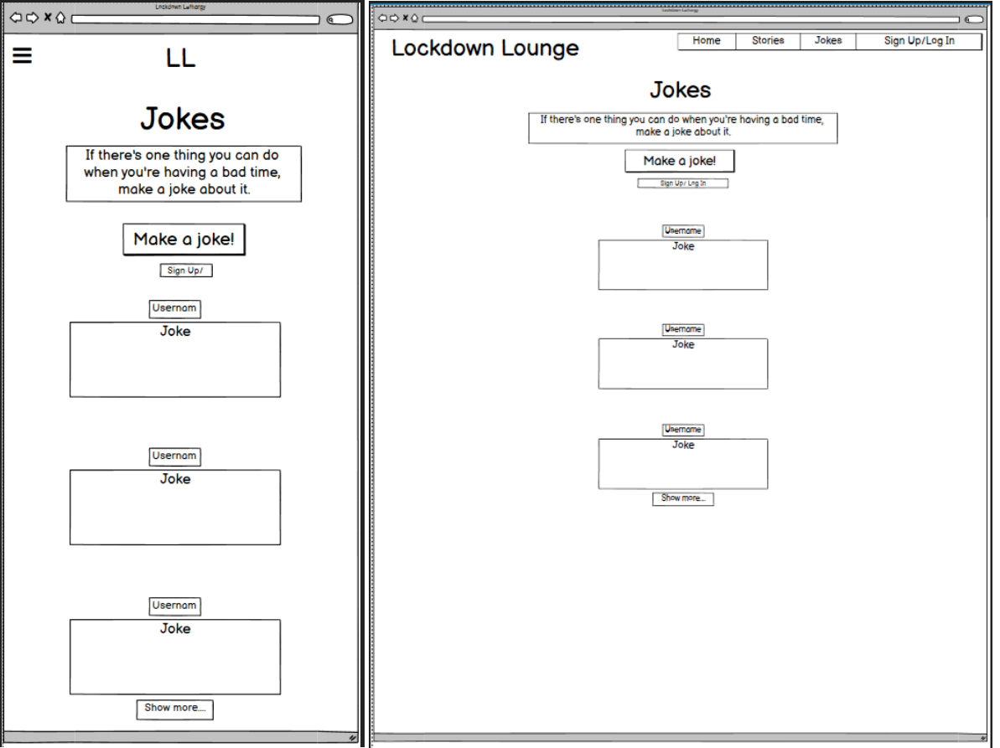
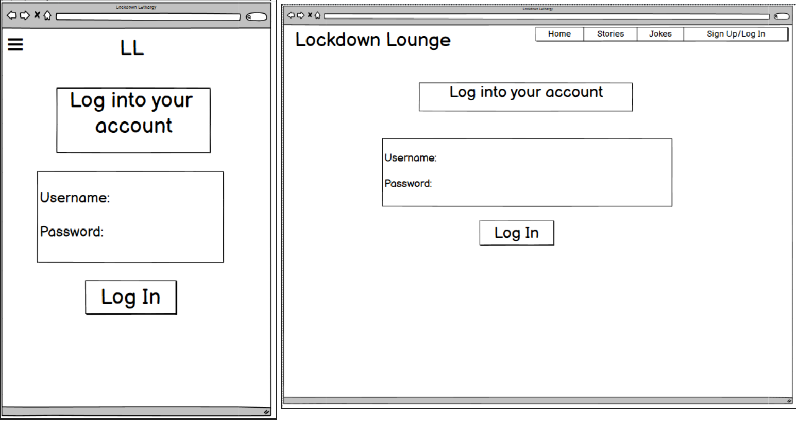

# Milestone Project 3

## Backend Development

### The Lockdown Lounge
Welcome to the Lockdown Lounge! This website forum has been created for you to share some stories or jokes with everybody else bored and stuck inside. The aim of the website is to give people some space to unwind and spent some of that free time looking at how other people have managed to get through it all. 

The users can create their own account and use this to comment on peoples stories or jokes. They can also post their own content is they're logged in. If they're not registered, they will only be allowed to view the content. Not comment or add their own stuff. This is to encourage people coming back to the website. The user can also view their own content on their account page where they can easily edit or delete. Users are also able to comment on other people's content. 

### User experience
Here are some examples of potential circumstances different users might be in and how the website enables each other to use the website effectively. All of these experiences were tested and met by navigating to the relevant section of the website. 

#### New user coming to the website to browse
The new user will be taken to the index page and there is a small amount of text. As this is only a forum page, I haven't gone for large images or things like that, as it's purely user content based. 
They will be explained what the website is and where to go to find stories and jokes. They'll also be told they need to be signed up to leave comments or content. Links are on the page to take the user to the relevant page.

#### New user wanting to create a story
The user can go to the story page on the navigation bar at the top. If they are a mobile user, there is a burger icon in the top left corner for them to click on and the other pages will show on there. When they get to the page, they will be reminded that they need to register for an account before they can add a story. The Add Story button is only visible to users who have an account and are signed in.

#### New user wanting to comment on a story
As above the user will be told if they want to comment on a story, they'll have to register an account. They can then go to the stories pages and find a story they want to comment on.

#### New user wanting to look at jokes
The user is firstly taken to the home page where the website function is explained. They are given two options to get to the jokes page. They can either click on the jokes anchor tag, or go to the 'Jokes' link found in the navbar. 

#### New user wanting to comment on a joke
This is the same process as the user wanting to comment on a joke. They are told to register an account before doing so and are then able to comment on the joke.

#### New user wanting to add their own joke
Same process as the user wanting to create a story, then will need to go to the joke page after having registered their account.

#### New user wanting to sign in and register an account
This will be made clear is the user wants to add any content to the website. They will be given a link to the register page on each page of the website to make it easier for them to find, it also encourages them to create an account. This page is kept simple and the user only needs to input basic details to create their account.

#### User wanting to look at the stories they've added
This is after the user has signed into their account. They are then shown the Profile navigation tab. They can go onto this page and are taken to the 'Stories' tab which shows all of the stories they've created.

#### User wanting to edit a story they've added
This user can do this by either finding their story and clicking (hover on desktop) on the small green circle. This opens up and there is a yellow icon whih shows a pencil and a square. I chose this icon because it looks like the most comment icon when editing something. The user is then taken to another page for their story and the story title and content fields are pre-populated with the original story contents. They can then click on the edit button and their story will be edited. They will then be taken back to the stories page. 

#### User wanting to edit a joke they've added
This will be done similarly to editing a story. The use can find their own joke either from the Jokes page, or from within their profile page where it lists all of the jokes they've added to the website.

#### User wanting to look at what jokes they've added
This can be found if this user is logged into their account, and go to their profile page. It shows a list of all the jokes they've added, and they can click on each individual one to see if anybody has commented on their post.

#### User wanting to see if they've got a comment on any of their stories or jokes
The user will need to have an account and be signed into it. They can then go to their Profile page and see by what stories and jokes they've added by clicking on the relevant tab. From here, the user can edit or delete their joke or story. 

#### User wants to see other users jokes and stories
The user will need to find a story or joke and then click on a the username of the person they want to see. They will then be taken to a profile of that user, showing all of their content. They can then go into each individual joke or story to leave a comment, if they are signed in.

#### User wants to write a comment on somebody elses content
Users can do this, after registering and logging in to their account, on any joke or story. A button is shown at the bottom of the content, as well as the text box to write their comment.

### Wireframe designs 
All of the wireframes were designed at the start of the project to help me get an idea in my head of what I wanted to aim for. I wanted to create a very simple forum where people could share positive content with each other. The wireframes show both the deskptop and mobile designs. 

#### Index

This is the index page, where the user is first taken to when visiting the website. The design was to keep it simple and give only the required information about the website. I reduced the amount of text in the final version as I felt it was a bit of an information overload and unessessarily long. I added the log in and register buttons on this page so the user can easily navigate to these pages, as the aim of the website it to get more users, and therefore more content.

#### Stories

The stories page shows all of the stories which have been created and added by all registered users. From here, the user can click on somebodies username to take them to ther profile page, where they can see all of that users content. The user will need to click onto a story card to see the full story, as only the heading is shown. There is also a search bar at the top of the page which users can use to search a stories title or content. 

#### Story

This is the page a user is taken to when they click on a story they want to read. The user can also see any comments which have been left by other people

#### Jokes

This works the same as the stories page, except is shows all of the jokes (surprisingly). 

#### Joke

Page shown when a user clicks a joke card. They are able to see any comments left by other users, and leave their own if they're registered and logged in.

#### Edit page

This page has the same layout across all areas of editing, stories, jokes, comments. It displays the current content in the fields, so the user can easily see what they need to change.

#### Add content page

This page has the same layout across adding stories and jokes. It displays a title and content field for the user to fill. The fields will change sizes depending on how much is written inside.

#### Account

This page is only visable if the user is logged into their account. From here they are able to see their own jokes and stories, as well as edit and delete them. 

#### Profile

If a user clicks on another persons username, they will be taken to their profile where they can see all of the stories and jokes that user has created.

#### Login

If a user already has an account, they are taken to this page. They'll need to provide their username and password, which they created in the register page

#### Register

If a user wants to be able to leave their own comments or create content, they need to register an account first. They'll need to provide their email address, create a username and password to create an account.

### Features
This website is designed to allow users to easily navigate through the different pages to find a joke or story. They are told from their initial visit that they will have to have their own user account set up and signed into before being allowed to add any of their own content. 

#### Account
One of the features is the account set up. Users can choose their own username and password, they are also required to add their own email address. This can later lead on to getting notifications from the website whenever somebody comments on their content.

#### Creating content
Users, after logging in, can post their own content on either page. Whenever they do so, they can see their content on the relative page.

#### Reading data
Each piece of content is stored in MongoDb and is retrieved depending on the page, account status and if the user is the content creator.

#### Edit/Delete
User, if they are logged on, can edit or delete their own content from two places: their stories/jokes page and the Profile page. This allows users to have control over their account and content by removing or fixing and comments they've made. They are also able to delete or edit their own comments after they've posted them by finding the comment they wish to change/delete.

#### Mobile version
Users using mobile can easily navigate and see the various pages by clicking on the burger icon in the top left of the screen. This is to allow more space on the screen and stop the need to reduce the size of the text.

#### Profile
Users cant look at each others content by clicking on their name found anywhere on the joke, story or comment. This is to open the doors to having your own personal area where others can view and comment on anything else they've created.

### Features left to implement

#### A favourites system
I began trying to implement the favourites system, however unfortunately being realistic with time, I was unable to implement it. The system was there to have a star of similar icon on the story or joke, and allow a user to click it to save it to their favourites. This then would have been added to the database, along with their own personal account ID, to allow them to see it in their own Profile page

#### An 'upvote' system
Similar to the one found on Reddit, the amount of up and down votes would have been shown on the joke or comment itself. This would have fedback to the user within their Profile screen to see if there content is liked or disliked by other users. Working similarly to the favourites system, this will be implemented to add more interaction with the content. 

#### Reset password
I feel this is an important feature to implement as it gives the user more control over the security of their own account. It will enable a logged in user to change their current password to a more secure one, if they feel their account is vulnerable.

### Technologies used

[flask](https://flask.palletsprojects.com/en/1.1.x/) - Used alongside Python as the web framework for the project.

[python3](https://www.python.org/) - Used create functions allowing the use of linking to mongoDB.

[HTML5](https://en.wikipedia.org/wiki/HTML5) - Markup language used to display files in a browser.

[CSS3](https://en.wikipedia.org/wiki/CSS) - Used for styling purposes, allowing consistency across the website.

[JQuery](https://jquery.com/) - Used with Materialize to create basic responsive elements within the website.

[Materialize](https://materializecss.com/) - Used for the basic CSS layouts, as well as basic forms and navigator bar.

[Balsamiq](https://balsamiq.com/) - To create wireframes at the initial design stage of the project.

[MongoDB](https://www.mongodb.com/cloud/atlas) - Used for the database and storage of the objects created in the website.

[Font-awesome](https://fontawesome.com/) - Used for the icons shown against some of the fields in the website.

[Google-fonts](https://fonts.google.com/) - For the fonts used in the website content.

[GitHub](https://github.com/) - Used for version control, storing the code used for the website and to enable editing/deleting.

### Testing

Find [here](https://github.com/Side-On/lockdownLounge-MP3/blob/master/test.md) for tests on the CSS, HTMl, JavaScript and Python aspects of the project. Unfortuntely they're not as extensive as I would have liked, this was due to timescales and needing to get the project submitted in time. This also includes information on the validator tests that were performed on each html page, css and js file.

### Code used

The code which is used to get the user up with reigstration and logging in was taken from the Code Instutite mini project within the course. After writing the code along with the course, I then used it in this project as it did what I wanted to do.

All of the code I used I've tailored to suite my needs. I've taken sections of code from the mini project within the course, however manipualted it to suite why I needed my app to do. There has also been some code which was fixed by speaking to the tutor support system provided by the Code Institute. 

#### Code also used from:

(https://stackoverflow.com/) - for general searches to discover reasons for errors.
(https://www.w3schools.com/) - used similarly to stackoverflow.

### Deployment

#### Configuration within Python and required code 
Initially you'll need to configure your app.py file. You'll be required to import your local env.py for local environments in order to connect with Heroku.

Add this doe to your app.py (or whatever is the file name for your app) as follows:

    if os.path.exists('env.py'):
        import env

    app = Flask(__name__)

    app.config['MONGO_DBNAME'] = os.environ.get('MONGO_DBNAME')
    app.config['MONGO_URI'] = os.environ.get('MONGO_URI')
    app.secret_key = os.environ.get('SECRET_KEY')

    mongo = PyMongo(app)

At the bottom of the app.py file, enter this code (Before deployment, ensure debug=False)

    if __name__ == '__main__':
        app.run(host=os.environ.get('IP'),
                port=int(os.environ.get('PORT')),
                debug=False)

You'll also need a 'Procfile' and ensure your requirements.txt are up to date. This can be placed into your root folder. Within this folder, add this code on the first line: web: python app.py. Ensure that there isn't a blank line underneath as this can cause errors.

Next you'll want to install the requirements.txt file. To do this, type the following command in the terminal: pip3 install -r requirements.txt. This will tell Heroku what requirements are needed to run the app. (More information on Heroku below)

Finally, create and env.py file. Enter the below code into this file. In the "secret key" section, go to a random key generator to get this secret key. You will need to create a SECRET_KEY and input the IP and PORT settings. I used Random Key Gen.

    import os

    # App config
    os.environ.setdefault("IP", "0.0.0.0")
    os.environ.setdefault("PORT", "5000")
    os.environ.setdefault("SECRET_KEY", "<Your secret key>")

    # MongoDB config
    os.environ.setdefault(
        MONGO_URI", "mongodb+srv://<user>:<password to database>@<cluster name>.43yzg.mongodb.net/<database name>?retryWrites=true&w=majority
    os.environ.setdefault("MONGO_DBNAME", "<database name>")

#### Copying the GitHub project

GitHub Pages

The project was deployed to GitHub Pages using the following steps...

Log in to GitHub and locate the GitHub Repository.

At the top of the Repository (not top of page), locate the "Settings" Button on the menu.

Scroll down the Settings page until you locate the "GitHub Pages" Section, copy the link shown.

Under "Source", click the dropdown called "None" and select "Master Branch".

The page will automatically refresh.

Scroll back down through the page to locate the now published site link in the "GitHub Pages" section.

Making a Local Clone

Log in to GitHub and locate the GitHub Repository.

Under the repository name, click "Clone or download".

To clone the repository using HTTPS, under "Clone with HTTPS", copy the link.

Open Git Bash.

Change the current working directory to the location where you want the cloned directory to be made.

Type git clone, and then paste the URL you copied in Step 3.

$ git clone https://github.com/YOUR-USERNAME/YOUR-REPOSITORY

Press Enter. Your local clone will be created.

### Heroku

Sign up to Heroku
Click on the create new app button
Select which region is closest to you
Find the section which relates to deployment method
Set this to GitHub
Using your GitHub login details, connect to GitHub
Enter the repository you wish to connect to and deploy from
In the settings section, go to Config Vars
This is where you enter the details you used when creating the env.py file, containing your database url and information
Ensure you have your Procfile set up correctly and updated
Also ensure the requirements.txt file has been updated with what is needed to run the app
Click the deploy tab
Select which branch you want to deploy
Wait for the app to build
Click on the view button to see the app!

### Acknowledgements

As this project is mainly focused on the backend programming skills involving databases, I used Materialize to quickly create a basic looking website which then allowed me to create a forum style website. I also looked at websites such as reddit.com and urbandictionary for their simple layouts and inutuitive designs. Unfortunately due to personal circumstances, I was unable to make the first submission. There was a lot more I wanted to do with the project, however was unable to invest the time I wanted.

I used part of the deployment section from the readme.md file created by AWsSG: https://github.com/AwsSG/wurc/blob/master/README.md.

I used the tutor support on a few occassions as I was having some difficulty in some areas around the comments feature and retrieving data from the database. A huge thank you to them for pointing me in the right direction with some of the issues I was facing, especially the commenting feature.

I also used the basic idea of a mini project I went through within the Code Institute course, mainly the registration and log in feature as it is best suited what I wanted from this website. 

I've used jokes from [ReadersDigest](https://www.rd.com/list/short-jokes/) and stories from [ThoughtCatalog](https://thoughtcatalog.com/).